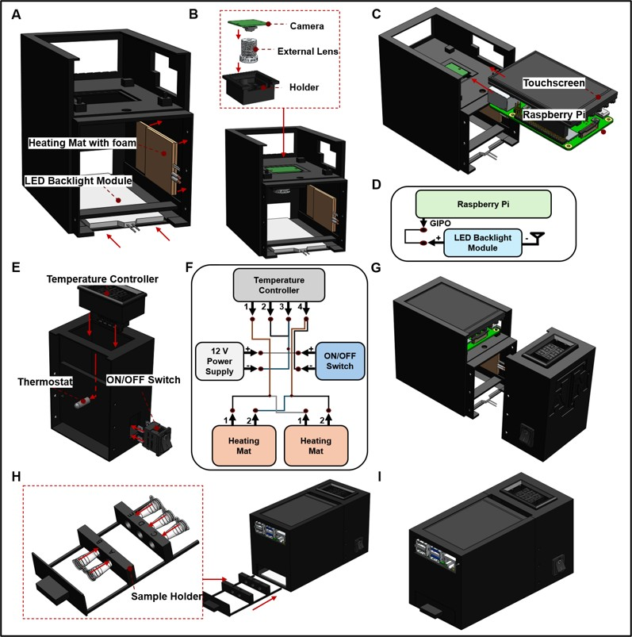
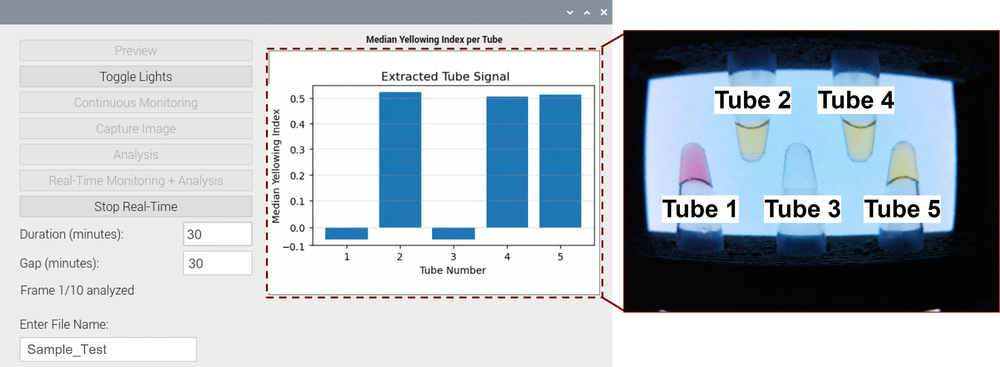

---

# *An Open-Source All-in-One Colorimetric Point-of-Care Device for Real-Time and Automated Monitoring of Loop-Mediated Isothermal Amplification*

An open-source, 3D-printed, all-in-one platform for real-time monitoring of colorimetric loop-mediated isothermal amplification (LAMP) reactions. The device integrates controlled heating, uniform white back-illumination, automated image acquisition, and on-device image analysis through a Raspberry Pi touchscreen graphical user interface (GUI).

The current platform monitors **five 0.2 mL reaction tubes in parallel** and quantifies the pink-to-yellow color transition of pH-sensitive colorimetric LAMP reactions using a normalized yellowing index. The software supports live preview, single-image capture, time-lapse acquisition, offline folder analysis, and combined real-time acquisition and analysis.

---

## 🔧 Features

* All-in-one integration of heating, illumination, imaging, control, and analysis
* Simultaneous monitoring of five colorimetric LAMP reactions
* Raspberry Pi –based operation with an integrated touchscreen GUI
* Fixed imaging geometry with a 34 mm × 34 mm field of view and 38 mm working distance
* Uniform white LED back-illumination beneath the reaction tubes
* Single-image and automated time-lapse image acquisition
* User-defined acquisition duration, capture interval, and experiment folder name
* Real-time tube segmentation and frame-by-frame signal extraction

---

## 📋 Material List

The values below correspond to the prototype configuration reported in the manuscript. Prices reflect the estimated contribution of each component to one assembled device and may change by supplier, location, or purchase date.

| Component | Component number | Quantity per device | Estimated cost per device |
|---|---:|---:|---:|
| Raspberry Pi 4B, 4 GB | RPI4-MODBP-4GB | 1 | $70.99 |
| Raspberry Pi power supply | 5V3A | 1 | $10.99 |
| Touchscreen | 782917535652 | 1 | $33.99 |
| Camera module | OV5647 | 1 | $24.99 |
| External M12 lens | M25360H06 | 1 | $7.99 |
| LED backlight module | B00R5CDIG4 | 1 | $4.85 |
| Jumper wires | 10CM4INCH | 6 | $0.45 |
| Temperature controller | B08W2BYG2L | 1 | $5.50 |
| Silicone heating mats | 1279 | 2 | $9.80 |
| AC 12 V power-supply charger | B0DHXXLY5Z | 1 | $9.28 |
| Foam insulation sheet | FSSA01 | 1 | $2.75 |
| ON/OFF switch | KCD1-101 | 1 | $0.90 |
| ABS-CF10 3D-printed case | ABS-CF10 | 1 set | $66.67 |
| **Total estimated cost per device** |  |  | **$249.15** |

---

## 🛠️ OpenLAMP Device Assembly


<p align="center">
  
</p>

**A. Heating and illumination unit**

Install the two silicone heating mats inside the heating chamber. Place the foam insulation behind the heating mats to reduce heat loss and protect the printed enclosure. Install the white LED backlight module beneath the sample region so that illumination is directed upward through the reaction tubes.

**B. Camera and external lens**

Insert the OV5647 camera module, M25360H06 external lens, and camera holder into the imaging unit. Confirm that the lens is centered above the five-tube sample holder and that the working distance is maintained at approximately 38 mm.

**C. Touchscreen and Raspberry Pi**

Install the touchscreen and Raspberry Pi 4B in the upper section of the enclosure. Route the camera ribbon cable and display connections without bending or pinching the cables.

**D. LED control connection**

Connect the LED control wiring to the Raspberry Pi GPIO connection used by the software. The current script defines two GPIO-controlled light outputs using BCM GPIO **16** and **26**, with GPIO 16 selected as the default active illumination channel.

**E. Temperature-controller unit**

Install the programmable temperature controller, thermistor connection, and ON/OFF switch in the side heating enclosure.

**F. Heating-unit wiring**

Connect the 12 V power supply, temperature controller, ON/OFF switch, and both heating mats according to the wiring diagram. Confirm the controller terminal assignments before applying power.

**G. Join the device units**

Align the main imaging unit with the side heating/controller unit and secure both sections using the designated screws.

**H. Install the sample holder**

Place the five-tube sample holder into the lower opening of the assembled device. Confirm that the holder moves smoothly and consistently positions the reaction tubes within the camera field of view.

**I. Final assembly check**

Before operating the device, verify the following:

* Camera and external lens are secured.
* Touchscreen and Raspberry Pi connections are stable.
* LED backlight is centered beneath the tubes.
* Heating mats and insulation are fixed in position.
* Tube holder is fully inserted and aligned.
* All electrical connections are insulated and strain-relieved.

### Temperature calibration

The manuscript prototype used a controller setpoint of approximately **72 °C** to obtain an effective reaction-tube temperature of approximately **65 °C**. This offset is specific to the reported enclosure, heater placement, insulation, thermistor position, and ambient conditions.

Do not assume that the controller display equals the temperature inside the LAMP reaction tubes. Calibrate every newly assembled device using an independent temperature probe positioned at the reaction-tube region before performing LAMP experiments.

---

## 📦 Installation (Dependencies)

### Install the required Python packages

The current application imports PyQt5, Picamera2, gpiozero, OpenCV, NumPy, pandas, Matplotlib, and openpyxl.

```bash
sudo apt install -y \
  python3-picamera2 \
  python3-pyqt5 \
  python3-opencv \
  python3-gpiozero \
  python3-numpy \
  python3-pandas \
  python3-matplotlib \
  python3-openpyxl
```


## 🔌 Current Hardware and Software Configuration

The following settings are hard-coded in the current software and should be preserved when reproducing the reported configuration.

| Setting | Current value |
|---|---|
| Number of monitored tubes | 5 |
| Negative-control position | Tube 1 |
| Camera preview size | 640 × 480 pixels |
| Captured image size | 2592 × 1944 pixels |
| Image format | 24-bit RGB JPEG |
| Camera exposure time | 20,000 µs |
| Automatic white balance | Disabled |
| Fixed color gains | Red = 1.8; Blue = 1.3 |
| Illumination stabilization time | 2 s |
| Default LED GPIO | BCM GPIO 16 |
| Alternate LED GPIO | BCM GPIO 26 |
| Main application window | 790 × 470 pixels |
| Output root directory | `/home/pi5/Pictures/` |


### Tube seed coordinates

The tube-segmentation algorithm uses the following image coordinates for 2592 × 1944-pixel images:

| Tube | x coordinate | y coordinate |
|---:|---:|---:|
| 1 | 524 | 929 |
| 2 | 902 | 779 |
| 3 | 1316 | 914 |
| 4 | 1586 | 776 |
| 5 | 1937 | 920 |

> These coordinates are specific to the reported camera position, lens, working distance, tube holder, and image resolution. If the camera or sample holder is moved, the seed coordinates must be recalibrated.

---

## 🖥️ GUI Usage Instructions

<p align="center">
  
</p>

The GUI separates user controls on the left from the real-time tube-signal plot on the right.

### 1. Start the heating system

The Python application controls imaging, illumination, acquisition, and analysis. The heating system is operated through the external temperature controller.

1. Turn on the temperature-controller unit.
2. Set the calibrated controller setpoint.
3. Wait until the reaction-tube region reaches the required LAMP temperature.
4. Load the sealed reaction tubes into the sample holder.
5. Insert the sample holder completely into the device.

### 2. Enter the file name or sample ID

Use **Enter File Name** to define the image name or experiment-folder name.

Use a short, unique identifier without special characters, for example:

```text
US23_100pg_Run01
```

### 3. Preview

Select **Preview** to open the live camera window.

Use the preview to confirm:

* All five tubes are visible.
* The LED backlight is uniform.
* The image is in focus.
* No tube is blocked by the holder or enclosure.

Close the preview window before starting an acquisition.

### 4. Toggle Lights

Select **Toggle Lights** to switch between the two GPIO-defined illumination outputs.

The script uses:

* GPIO 16 as the default active light
* GPIO 26 as the alternate light

For the reported white-backlight configuration, use the GPIO channel connected to the white LED backlight module.

### 5. Capture Image

Select **Capture Image** to save one still image.

The image is saved as:

```text
/home/pi5/Pictures/FILE_NAME.jpg
```

This mode does not automatically create an experiment folder or perform image analysis.

### 6. Continuous Monitoring

Use **Continuous Monitoring** for automated time-lapse image acquisition without immediate analysis.

Enter:

* **Duration (minutes):** total requested acquisition duration
* **Gap (minutes):** delay between successive acquisitions
* **Enter File Name:** output-folder name

The software calculates the number of frames as:

```text
Number of frames = round(Duration / Gap)
```

For each frame, the active LED is turned on, the software waits 2 s, captures the image, turns the LED off, and waits until the next acquisition.

Images are saved sequentially as:

```text
1.jpg
2.jpg
3.jpg
...
```

### 7. Analysis

Select **Analysis** to process all `.jpg` images already stored in the experiment folder.

The software:

1. Reads all JPEG images in natural numerical order and processes them.
2. Detects the five tube regions.
3. Calculates the raw median yellowing index for every tube.
4. Generates summary plots and CSV.

### 8. Real-Time Monitoring + Analysis

Use **Real-Time Monitoring + Analysis** to acquire and analyze every frame during the experiment.

For each frame, the software:

1. Turns on the active LED.
2. Waits 2 s for illumination stabilization.
3. Captures a JPEG image.
4. Turns off the LED.
5. Segments the five tube regions.
6. Calculates the current yellowing-index values.
7. Updates the status text.
8. Updates the latest five-tube bar plot.
9. Updates the running CSV file.
10. Saves the final Excel workbook when the run ends or is stopped.

### 9. Stop Real-Time

Select **Stop Real-Time** to end the combined acquisition and analysis process after the current processing step.

When at least one frame has been completed, the application saves a partial final Excel workbook before stopping.

### 10. Results and real-time plot

The status area displays:

* Current frame number
* Analysis time
* Time remaining before the next frame

The right panel displays the **raw median yellowing index from the latest frame** as a five-bar plot.


## 🗂️ Save Image and Results Folder Structure

### Single-image capture

```text
/home/pi5/Pictures/
└── Sample_Name.jpg
```

### Continuous monitoring without analysis

```text
/home/pi5/Pictures/
└── Experiment_Name/
    ├── 1.jpg
    ├── 2.jpg
    ├── 3.jpg
    ├── ...
    ├── Analysis_Yellowing_Index.csv
    ├── Analysis_Median_Yellowing_Index.png
    └── Analysis_Yellowing_Index.xlsx

```


### Continuous monitoring and real-time analysis

```text
/home/pi5/Pictures/
└── Experiment_Name/
    ├── 1.jpg
    ├── 2.jpg
    ├── 3.jpg
    ├── ...
    ├── RealTime_Yellowing_Index_Running.csv
    ├── RealTime_Median_Yellowing_Index.png
    ├── RealTime_Yellowing_Index_Final.xlsx
    └── RealTime_Mask_Overlays/
```

## 📚 Citation

Citation information will be updated after publication.

Althumayri MO, Xu W, Zhao J, Scaccia N, Inan YS, Song J, Figueiredo Costa S, Sabino E, Ceylan Koydemir H. *An Open-Source All-in-One Colorimetric Point-of-Care Device for Real-Time and Automated Monitoring of Loop-Mediated Isothermal Amplification.* Manuscript in preparation.

